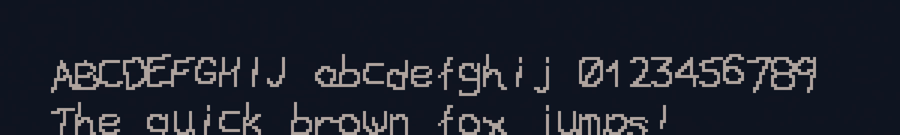

# scrawl-console-font

The Slackware `scrawl` console font — a hand-scrawled-looking bitmap
typeface from the old Linux `kbd` package — packaged for use in a modern
Wayland terminal instead of just the raw text console.



## Backstory

`scrawl_s.fnt.gz` and `scrawl_w.fnt.gz` are 8x16 pixel bitmap fonts meant
for the Linux virtual console (`setfont`), bundled with Slackware's `kbd`
package. They only work on the raw TTY — GPU terminal emulators can't load
that format at all. This repo converts them to BDF (a format FreeType
understands) and packages the result for Arch/Omarchy, along with a config
fragment for the `foot` terminal.

## Install (Arch / Omarchy)

```sh
git clone <this repo>
cd scrawl-console-font
makepkg -si
```

Or, without cloning or needing build tools, grab the prebuilt package from
[Releases](https://github.com/deegan/scrawl-console-font/releases/latest)
and install it directly:

```sh
sudo pacman -U scrawl-console-font-*-any.pkg.tar.zst
```

Then wire it into `foot`:

```sh
scrawl-font-setup-foot           # ScrawlS, the 8x16 "short" variant
scrawl-font-setup-foot ScrawlW   # or the wide variant
```

Open a new `foot` window — existing ones won't pick up the change.

This edits `~/.config/foot/foot.ini` directly (a backup of the previous
version is saved alongside it). If you'd rather do it by hand, see
`foot-scrawl.ini` for the settings and why each one is there.

## Install (macOS / iTerm2)

macOS won't install the font as-is: it's a raw bitmap format Core Text
doesn't read, and modern macOS (Catalina onward) also refuses to install
bitmap-only TrueType fonts, so simply embedding the bitmap the way the
Linux/foot side does doesn't work either. Instead, `bdf2ttf.py` traces each
glyph's pixels into vector rectangle outlines, producing an ordinary
scalable TTF that just happens to look exactly like the pixel font at any
size.

Requires [FontForge](https://fontforge.org/) (`brew install fontforge`):

```sh
git clone <this repo>
cd scrawl-console-font
./scrawl-font-setup-macos           # ScrawlS, the 8x16 "short" variant
./scrawl-font-setup-macos ScrawlW   # or the wide variant
./scrawl-font-setup-macos --no-icons  # skip Nerd Font icon patching
```

By default this also patches in Nerd Font icons — Powerline, Powerline
Extra, and IEC power symbols — using the official
[nerd-fonts](https://github.com/ryanoasis/nerd-fonts) `font-patcher`,
downloaded and checksum-verified into `build-macos/` on first run. Only
those three glyph sets are used; more detailed ones (Font Awesome, Material
Design, etc.) don't hold up traced into an 8px-wide cell. Even within those
three, a few icons with fine diagonal detail (e.g. the Powerline git-branch
glyph, U+E0A0) still come out illegible at 16pt — bump the profile's font
size in iTerm2 if you need those specific ones to read clearly; the simple
geometric icons (separators, padlock, power symbols) look fine at 16pt.

**Note:** Homebrew's `fontforge` (build `20251009` at the time of writing)
has a [known bug](https://github.com/fontforge/fontforge/commit/aedb8f2e)
that corrupts some patched glyphs. If icons come out visibly broken, rebuild
with `brew install fontforge --HEAD` and re-run.

This installs the font into `~/Library/Fonts` and adds a "Scrawl" iTerm2
Dynamic Profile (`~/Library/Application Support/iTerm2/DynamicProfiles/`)
that uses it, inheriting everything else from your Default profile. It
doesn't touch your existing profiles or iTerm2's main preferences — to
remove it, delete the font and the `scrawl-console-font.json` profile file.

Open iTerm2 → Preferences → Profiles and select "Scrawl" (restart iTerm2
first if it was already running).

Unlike `foot`, this isn't a fixed-pixel-size bitmap anymore — it's a normal
outline font, so it'll render at whatever point size you pick, not just one.
16pt matches the original pixel grid 1:1 at 100% scale; other sizes just
scale the same blocky shapes up or down.

## What's in this repo

| File | Purpose |
|---|---|
| `PKGBUILD` | Builds and packages everything below (Arch/Omarchy) |
| `scrawl_s.fnt.gz`, `scrawl_w.fnt.gz` | The original raw Slackware console fonts |
| `raw2bdf.py` | Converts the raw font to BDF at build time |
| `bdf2ttf.py` | FontForge script: traces a BDF's pixels into a scalable TTF (macOS path) |
| `foot-scrawl.ini` | The `foot` settings this font needs, with comments explaining why |
| `scrawl-font-setup-foot` | Installed to `/usr/bin` by the Arch package; patches `foot.ini` for you |
| `scrawl-font-setup-macos` | Run directly from the clone; builds the TTF, patches in Nerd Font icons, and wires it into iTerm2 |
| `scrawl-console-font.install` | pacman hook: refreshes the font cache after install |

## Notes

- On `foot`, it's a fixed-size 16px bitmap font — there is no other size.
  `pixelsize=16` and `dpi-aware=yes` in `foot.ini` are both required,
  otherwise `foot` multiplies the pixel size by your monitor's scale factor
  and the font gets blurrily upscaled. The macOS TTF doesn't have this
  restriction since it's vector outlines, not an embedded bitmap.
- There's no embedded Unicode table, but the upper 128 glyphs sit at their
  classic CP437 code points (verified by inspection — 0x86 is "a with a ring
  above", 0xDB is a full block, etc.), the same codepage the raw Linux
  console used before UTF-8. `raw2bdf.py` decodes every byte through CP437
  to get its real Unicode codepoint, so accented Latin letters (åäö, etc.)
  and box-drawing characters land correctly in both the BDF and the macOS
  TTF. It's still only 256 glyphs plus whatever Nerd Font icons got patched
  in on macOS — most non-Latin scripts and emoji aren't in the font and
  won't render; that's expected, not a bug.
- The Linux/`foot` path is not tested outside `foot`. Other terminals
  (Alacritty, Kitty, Ghostty) have much weaker bitmap-font support and may
  not render the BDF well. The macOS TTF is a normal outline font, so it
  should work in any Mac terminal that lets you pick a custom font, not just
  iTerm2 — only the Dynamic Profile wiring is iTerm2-specific.

## License

The font data comes from Slackware's `kbd` package (GPL-2.0-or-later). The
conversion script and packaging in this repo are released under the same
terms.

On macOS, unless run with `--no-icons`, the installed font also incorporates
icon glyphs pulled in at build time by the [nerd-fonts](https://github.com/ryanoasis/nerd-fonts)
`font-patcher` (MIT), from the Powerline, Powerline Extra, and IEC Power
Symbols glyph sets (all MIT-licensed) — none of that is vendored in this
repo, it's downloaded and merged locally when you run
`scrawl-font-setup-macos`.
